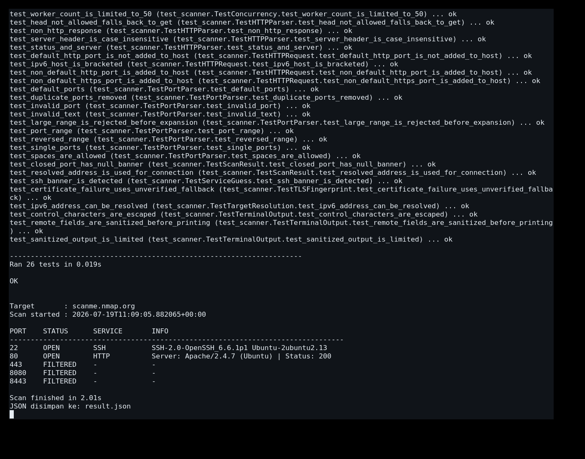

# Simple Port & Service Fingerprint Tool

Tool CLI sederhana berbasis Python untuk melakukan TCP connect scan secara
concurrent dan mengidentifikasi service pada port terbuka melalui respons
HTTP/HTTPS, metadata TLS, atau banner awal service.

## Requirements

- Python 3.10
  
## Instalasi

Download atau salin folder project, lalu masuk ke direktorinya:

```bash
cd simple-port-fingerprint
```
Pastikan Python tersedia:

```bash
python --version
```

## Struktur project

```text
simple-port-fingerprint/
├── scanner.py
├── README.md
├── result.json
└── tests/
    └── test_scanner.py
```

## Usage

Tampilkan bantuan:

```bash
python scanner.py --help
```

Scan port default:

```bash
python scanner.py scanme.nmap.org
```

Scan port custom dan range:

```bash
python scanner.py scanme.nmap.org -p 22,80,443,8000-8005
```

Atur timeout dan worker, lalu export JSON:

```bash
python scanner.py scanme.nmap.org \
  --ports 22,80,443,8000-8005 \
  --timeout 2 \
  --workers 10 \
  --output result.json
```

### Options

- `-p`, `--ports`: daftar port atau range yang dipisahkan koma
- `-t`, `--timeout`: timeout setiap operasi koneksi dalam detik
- `-w`, `--workers`: jumlah thread concurrent, dibatasi maksimum 50
- `-o`, `--output`: lokasi file hasil JSON

Port default: `80, 443, 8000, 8080, 8081, 8443, 8888, 3000, 5000, 9000`.

## Contoh output

```text
Target       : scanme.nmap.org
Scan started : 2026-07-19T03:00:00+00:00

PORT    STATUS      SERVICE       INFO
--------------------------------------------------------------------------------
22      OPEN        SSH           SSH-2.0-OpenSSH
80      OPEN        HTTP          Server: Apache | Status: 200
443     CLOSED      -             -
8080    FILTERED    -             -

Scan finished in 2.13s
JSON disimpan ke: result.json
```

Status `closed` biasanya berarti koneksi ditolak, sedangkan `filtered`
menunjukkan timeout atau error jaringan lain. TCP connect scan tidak selalu
dapat membedakan keduanya secara sempurna.

Tool membatasi respons HTTP/HTTPS hingga 8192 byte dan generic banner hingga
1024 byte. Jika validasi sertifikat TLS gagal karena self-signed atau hostname
mismatch, tool mencoba kembali tanpa verifikasi dan menandainya sebagai
`certificate_verified: false` pada JSON.

## Menjalankan test

Dari folder project:

```bash
python -m unittest discover -s tests -v
```

## Pengujian

Contoh

```bash
python scanner.py scanme.nmap.org \
  -p 22,80,443,8080,8443 \
  -t 2 \
  -w 10 \
  -o result.json
```


## Screenshot hasil pengujian


